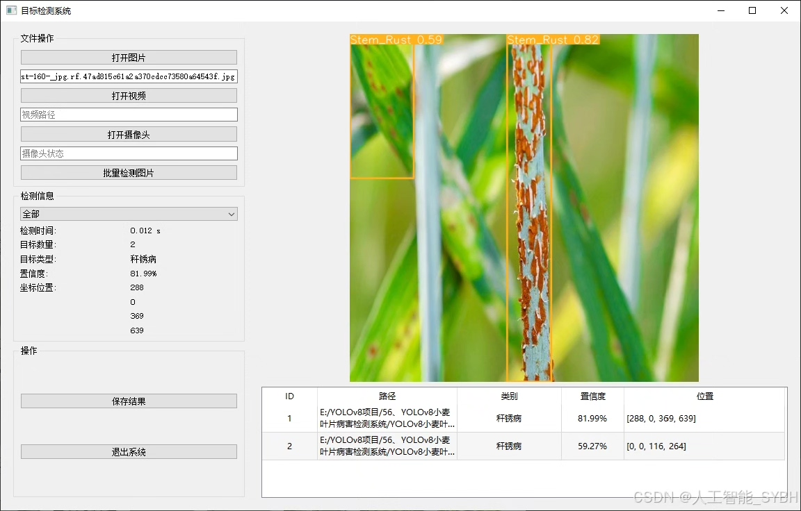
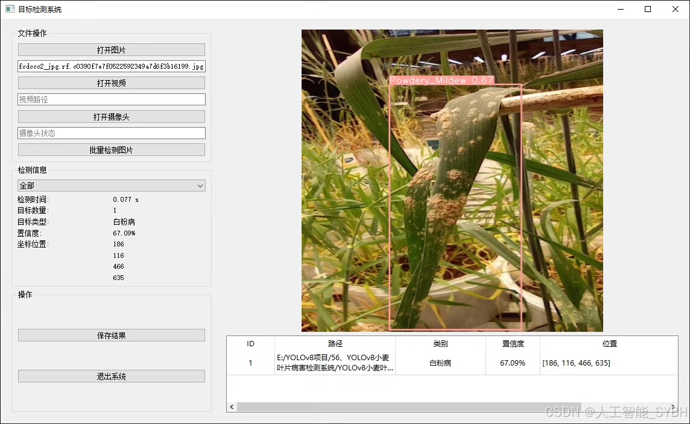
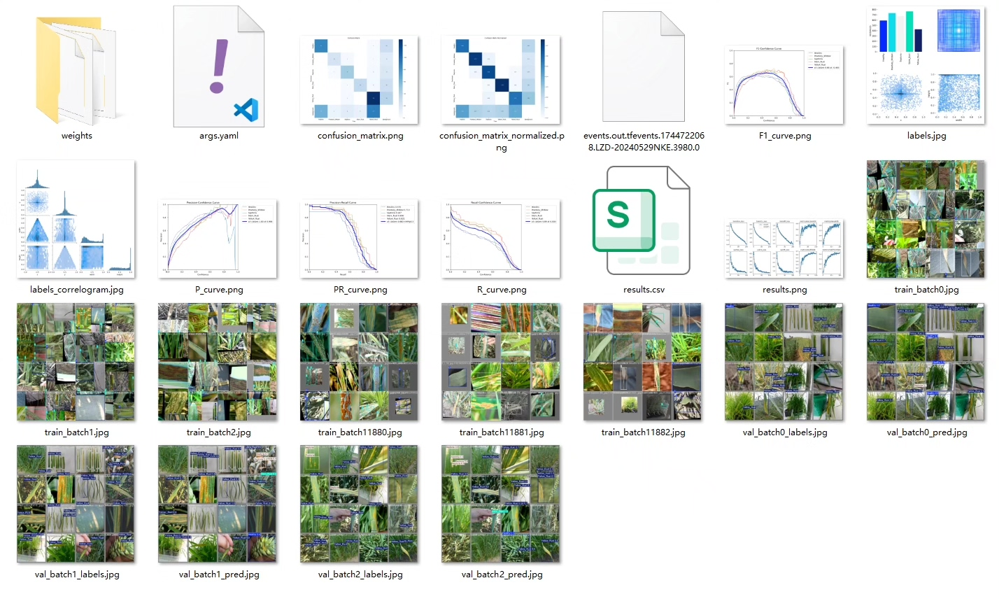
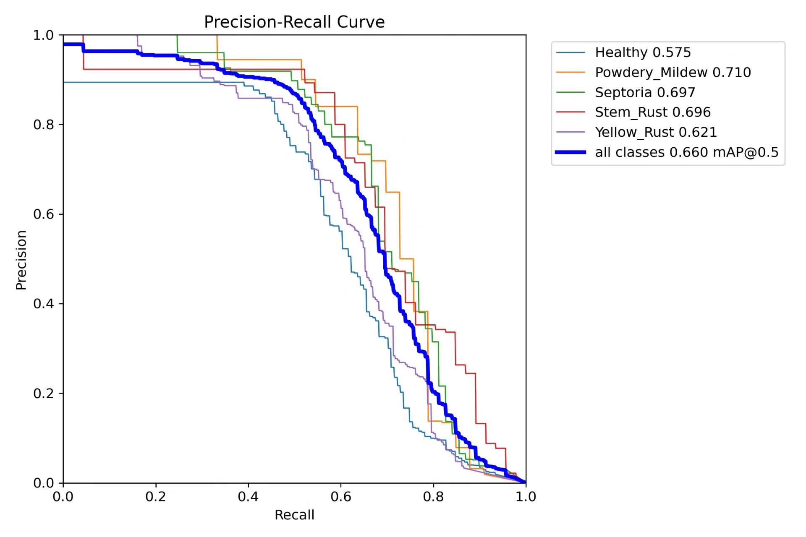
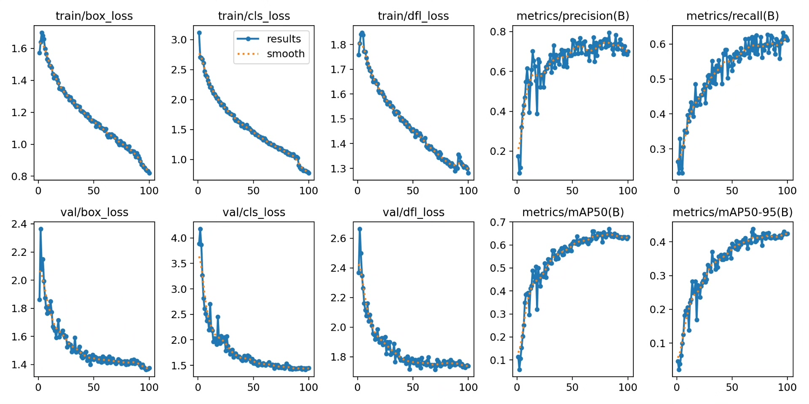
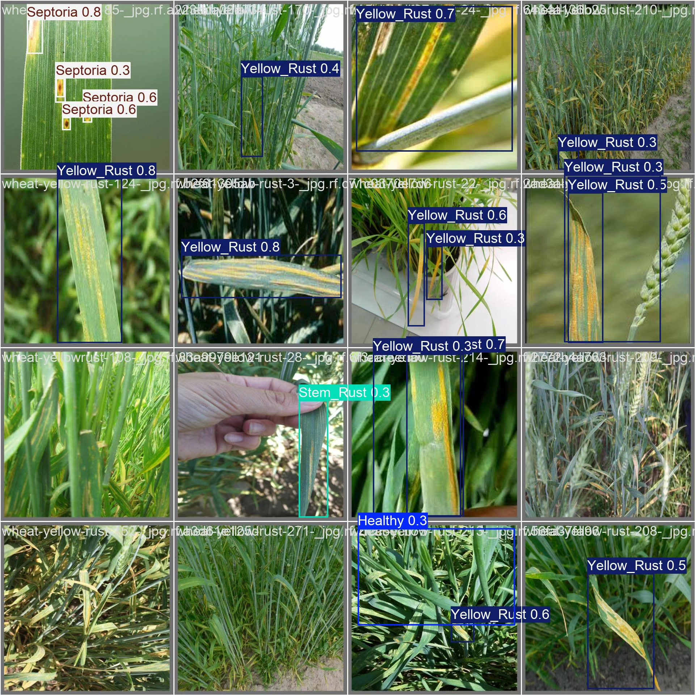
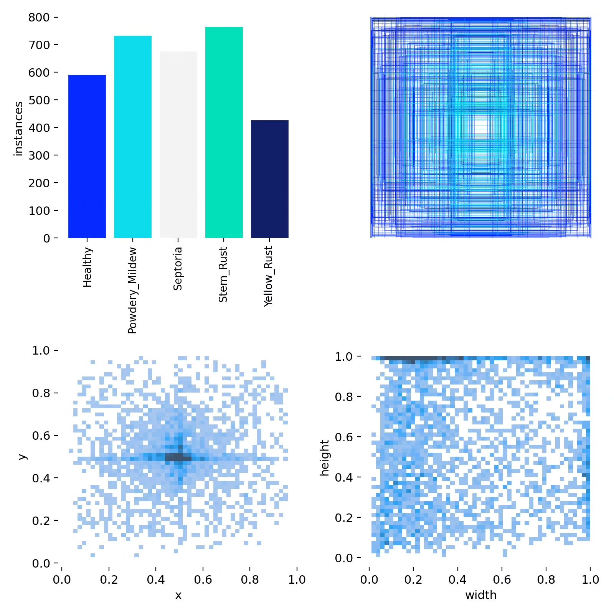
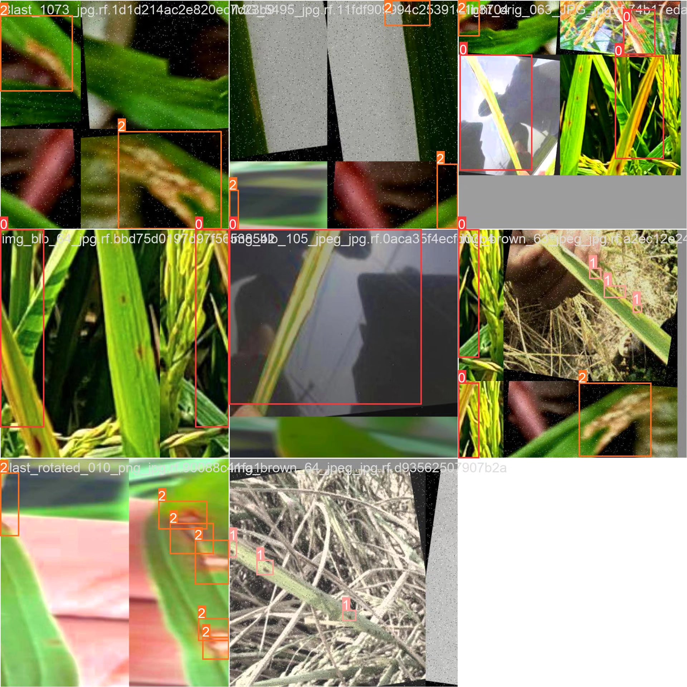

# Wheat leaf disease detection system based on YOLOv8 deep learning

## Body

Based on the advanced YOLOv8 object detection algorithm, this project has developed a high-efficiency and accurate automatic detection system for wheat leaf diseases. The system classifies and recognizes five common wheat leaf health conditions, including Healthy leaves (Healthy), Powdery mildew (Powdery_Mildew), Septoria, Stem rust (Stem_Rust), and Yellow rust (Yellow_Rust). The project uses a large-scale professional dataset for model training and validation, with a training set containing 2100 high-quality labeled images, a validation set of 366, and a test set of 138, ensuring the generalization ability and reliability of the model. This system can detect wheat leaf disease types in real time, providing timely disease diagnosis information for agricultural producers, assisting in early intervention decisions, and is of great significance for ensuring wheat yield and quality.

The company's products have obtained YOLO official commercial license certification.

We provide after-sales service

After payment, we will provide WeChat ID to answer questions at any time

Environmental configuration: We will provide an instruction tutorial for environmental configuration, and WeChat provides Q&A services.

Remote installation service: If you need remote configuration, an additional fee of 69 is required,
If the configuration fails, all fees are refunded (specially for old computers only refund installation fees)

Retraining dataset: After configuring the environment, you can train on your own computer.
If you need us to retrain, just pay 69 + computing power fees (2.5 yuan/hour)

Full after-sales service

## Images

## Payment

Here is a pay link on Stripe ( https://buy.stripe.com/3cs8yP7sY87d0vu9AB ). Please contact me lonlonago@foxmail.com after funding $89, and I will send you a complete data files , thank you!

